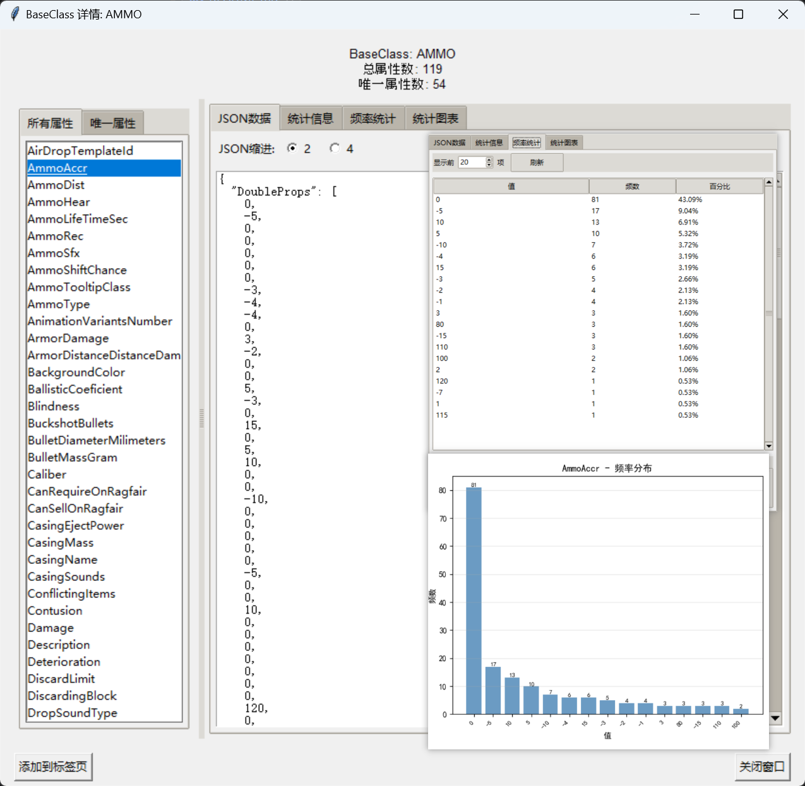

## PropertyAnalysis

一个Python项目，用于分析模组生成的缓存数据

安装依赖:

```shell
conda activate <yourEnvName>
conda install --yes --file requirements.txt
```

运行脚本:
```shell
python main.py
```

## 脚本功能

启用一个用tkinter实现的GUI界面, 可以从SptItemCreator运行时创建的缓存文件中收集数据, 提供一些统计数据, 提供一类物品有的所有属性名称与赋值, 方便物品创建



## 开始方式

1. 在main.py的同级目录创建一个名为`config.yaml`的文件, 并至少包含[必须的配置](#必须的配置)的内容
2. 打开窗口, 菜单栏: 文件-> 从文件夹加载数据
3. 选择`游戏根目录/SPT/user/mods/SptItemCreator/StatsCache`

## 必须的配置

需要在当前目录创建一个名为`config.yaml`的文件用于设置配置

```yaml
# 语言设置: zh (中文), en (英文)
Language: zh

# 默认值
StatsManagerSavePath: "data/StatsManager.plk"
CachePath: data/Cache.cache

# 调试值(为空的以列表字符串形式放置路径; 最后一个目前没有用到)
DataLoaderTestFilePaths:

DataLoaderTestFolder:

SptItemCreatorStatsCacheFolderPath: "SptItemCreator/StatsCache的绝对路径"
```