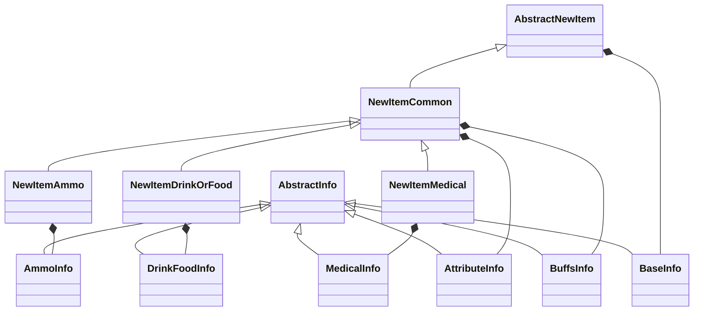
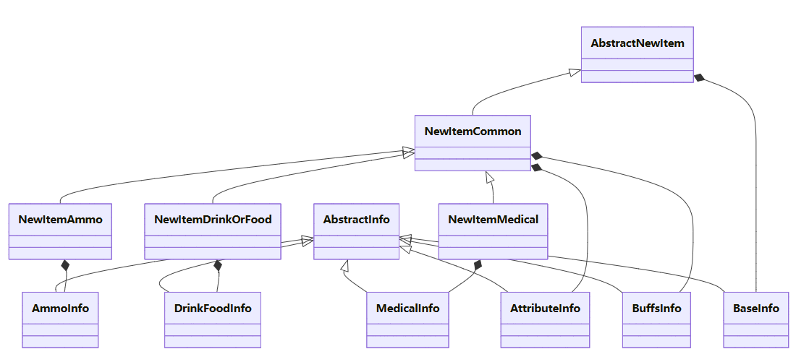

本章节主要介绍模组中的各个数据结构，方便理解关于新物品文件的编写

## 抽象层

抽象新物品基类

提供新物品创建和验证的基础功能

公开属性: 

- Enable: 是否启用物品
- BaseInfo(必选): 基础新物品信息，统一的储存新物品常用信息
- PropertyOverride(可选): 需要覆盖的属性/新物品相对于克隆物品修改了的属性 ，提供与其他模组类似的重载方式，以及方便使用从[items](https://github.com/sp-tarkov/server-csharp/blob/main/Libraries/SPTarkov.Server.Assets/SPT_Data/database/templates/items.json)复制的属性
    > 类型为[TemplateItemProperties](https://github.com/sp-tarkov/server-csharp/blob/895d53262e32e2c6a7116048c1c85bfa7770a858/Libraries/SPTarkov.Server.Core/Models/Eft/Common/Tables/TemplateItem.cs#L71)

```C#
[JsonDerivedType(typeof(AbstractNewItem), typeDiscriminator: "abstract")]
[JsonDerivedType(typeof(NewItemCommon), typeDiscriminator: "common")]
[JsonDerivedType(typeof(NewItemDrinkOrFood), typeDiscriminator: "drinkOrFood")]
[JsonDerivedType(typeof(NewItemMedical), typeDiscriminator: "medical")]
[JsonDerivedType(typeof(NewItemAmmo), typeDiscriminator: "ammo")]
public abstract class AbstractNewItem;
```


## AmmoInfo 弹药信息

> 弹药相关的属性过多, 后续还得扩充

继承自 `AbstractInfo` 的弹药信息记录类，用于定义弹药的详细属性和性能参数。

| 属性                     | 类型   | 说明                 | 可选项                                                       | 可选性 |
| ------------------------ | ------ | -------------------- | ------------------------------------------------------------ | ------ |
| **AmmoType**             | string | 弹药类型             | bullet，buckshot或grenade                                    | 可选   |
| **InitialSpeed**         | double | 初始速度 (m/s)       | 一般在300~900之间                                            | 可选   |
| **BulletMassGram**       | double | 弹头质量 (克)        | 一般在0.09~20之间                                            | 可选   |
| **Damage**               | double | 基础伤害值           | 一般在1~160之间                                              | 可选   |
| **PenetrationPower**     | int    | 穿甲能力             | 一般在0~70之间                                               | 可选   |
| **ArmorDamage**          | double | 对护甲伤害           | 一般在2~95之间                                               | 可选   |
| **FragmentationChance**  | double | 破片概率 (0-1)       | 有破片的一般在0.1~0.5之间                                    | 可选   |
| **RicochetChance**       | double | 跳弹概率 (0-1)       | 一般在0~0.4之间                                              | 可选   |
| **HeavyBleedingDelta**   | double | 重度流血伤害值       | 一般在0~0.3之间                                              | 可选   |
| **LightBleedingDelta**   | double | 轻度流血伤害值       | 一般在0~0.35之间                                             | 可选   |
| **Tracer**               | bool   | 是否曳光弹           | true / false                                                 | 可选   |
| **TracerColor**          | string | 曳光弹颜色           | [tracerColor(曳光弹颜色)可用的值](../常用常量/子弹相关常量/tracerColor(曳光弹颜色)可用的值.md) | 可选   |
| **Caliber**              | string | 弹药口径             | [caliber(口径)可用的值](../常用常量/子弹相关常量/caliber(口径)可用的值.md) | 可选   |
| **BuckshotBullets**      | int    | 霰弹弹丸数量         | 一般为0，8，9                                                | 可选   |
| **AmmoAccr**             | double | 弹药精度加成         | 一般为-10~10；极少数为120                                    | 可选   |
| **AmmoRec**              | double | 弹药后坐力加成       | 一般为-30~35；极少数为115                                    | 可选   |
| **AmmoDist**             | double | 弹药散布加成         | 一般为0(绝大多数)或10                                        | 可选   |
| **StaminaBurnPerDamage** | double | 每点伤害消耗的体力值 | 大多数为0.144，<br/>绝大多数在0.1152~0.144之间               | 可选   |


## 继承与组合关系




