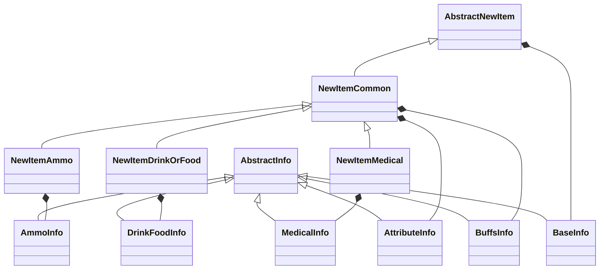

本章节主要介绍模组中的各个数据结构，方便理解关于新物品文件的编写

## 抽象层

抽象新物品基类

提供新物品创建和验证的基础功能

公开属性: 

- Enable: 是否启用物品
- BaseInfo(必选): 基础新物品信息，统一的储存新物品常用信息
- PropertyOverride(可选): 需要覆盖的属性/新物品相对于克隆物品修改了的属性 ，提供与其他模组类似的重载方式，以及方便使用从[items](https://github.com/sp-tarkov/server-csharp/blob/main/Libraries/SPTarkov.Server.Assets/SPT_Data/database/templates/items.json)复制的属性
    > 类型为[TemplateItemProperties](https://github.com/sp-tarkov/server-csharp/blob/895d53262e32e2c6a7116048c1c85bfa7770a858/Libraries/SPTarkov.Server.Core/Models/Eft/Common/Tables/TemplateItem.cs#L71)

```C#
[JsonDerivedType(typeof(AbstractNewItem), typeDiscriminator: "abstract")]
[JsonDerivedType(typeof(NewItemCommon), typeDiscriminator: "common")]
[JsonDerivedType(typeof(NewItemDrinkOrFood), typeDiscriminator: "drinkOrFood")]
[JsonDerivedType(typeof(NewItemMedical), typeDiscriminator: "medical")]
[JsonDerivedType(typeof(NewItemAmmo), typeDiscriminator: "ammo")]
public abstract class AbstractNewItem;
```

## BaseInfo 基础信息

继承自 `AbstractInfo` 的基础信息记录类，用于定义新物品的核心元数据和配置。

| 属性             | 必需性   | 默认值                                                  | 描述                                                   |
| ---------------- | -------- | ------------------------------------------------------- | ------------------------------------------------------ |
| Id               | **必需** |                                                         | 物品唯一标识符                                         |
| Type             | 可选     | "common"                                                | 模板类型                                               |
| Name             | 可选     | 未命名物品                                              | 物品名称, 简称                                         |
| Description      | 可选     | 名称+作者+协议<br/>（提供Locales后优先用Locales的描述） | 物品描述                                               |
| Locales          | 可选     | null                                                    | 物品的本地化信息                                       |
| Author           | 可选     | 佚名                                                    | 作者名称                                               |
| License          | 可选     | MIT                                                     | 使用协议                                               |
| Order            | 可选     | 0                                                       | 加载顺序                                               |
| ParentId         | 可选     | null                                                    | 父级ID, 当赋值了CloneId时可选, 当没有赋值CloneId时必需 |
| CloneId          | 可选     | null                                                    | 原型ID                                                 |
| HandbookParentId | 可选     | null                                                    | 手册父级ID                                             |
| TraderId         | 可选     | null                                                    | 默认商人ID                                             |
| FleaPrice        | 可选     | 1                                                       | 跳蚤市场价格                                           |
| HandbookPrice    | 可选     | 1                                                       | 手册价格(商人售卖价格)                                 |
| Prefab           | 可选     | null                                                    | 物品模型                                               |
| UsePrefab        | 可选     | null                                                    | 使用模型                                               |
| CanSellOnRagfair | 必需     | true                                                    | 跳蚤市场销售权限                                       |
| AllowAll         | 可选     | false                                                   | 一键允许所有容器放置本物品                             |
| CanFilter        | 可选     | []                                                      | 指定哪些容器可放置本物品(优先级大于allowAll)           |
| CantFilter       | 可选     | []                                                      | 指定哪些容器不可放置本物品(优先级大于allowAll)         |

> Locales可选键：, ch, cz, en, es-mx, es, fr, ge, hu, it, jp, kr, pl, po, ro, ru, sk, tu

## AmmoInfo 弹药信息

继承自 `AbstractInfo` 的弹药信息记录类，用于定义弹药的详细属性和性能参数。

| 属性                     | 类型   | 说明                 | 可选项                                                       | 可选性 |
| ------------------------ | ------ | -------------------- | ------------------------------------------------------------ | ------ |
| **AmmoType**             | string | 弹药类型             | bullet，buckshot或grenade                                    | 可选   |
| **InitialSpeed**         | double | 初始速度 (m/s)       | 一般在300~900之间                                            | 可选   |
| **BulletMassGram**       | double | 弹头质量 (克)        | 一般在0.09~20之间                                            | 可选   |
| **Damage**               | double | 基础伤害值           | 一般在1~160之间                                              | 可选   |
| **PenetrationPower**     | int    | 穿甲能力             | 一般在0~70之间                                               | 可选   |
| **ArmorDamage**          | double | 对护甲伤害           | 一般在2~95之间                                               | 可选   |
| **FragmentationChance**  | double | 破片概率 (0-1)       | 有破片的一般在0.1~0.5之间                                    | 可选   |
| **RicochetChance**       | double | 跳弹概率 (0-1)       | 一般在0~0.4之间                                              | 可选   |
| **HeavyBleedingDelta**   | double | 重度流血伤害值       | 一般在0~0.3之间                                              | 可选   |
| **LightBleedingDelta**   | double | 轻度流血伤害值       | 一般在0~0.35之间                                             | 可选   |
| **Tracer**               | bool   | 是否曳光弹           | true / false                                                 | 可选   |
| **TracerColor**          | string | 曳光弹颜色           | [tracerColor(曳光弹颜色)可用的值](../常用常量/子弹相关常量/tracerColor(曳光弹颜色)可用的值.md) | 可选   |
| **Caliber**              | string | 弹药口径             | [caliber(口径)可用的值](../常用常量/子弹相关常量/caliber(口径)可用的值.md) | 可选   |
| **BuckshotBullets**      | int    | 霰弹弹丸数量         | 一般为0，8，9                                                | 可选   |
| **AmmoAccr**             | double | 弹药精度加成         | 一般为-10~10；极少数为120                                    | 可选   |
| **AmmoRec**              | double | 弹药后坐力加成       | 一般为-30~35；极少数为115                                    | 可选   |
| **AmmoDist**             | double | 弹药散布加成         | 一般为0(绝大多数)或10                                        | 可选   |
| **StaminaBurnPerDamage** | double | 每点伤害消耗的体力值 | 大多数为0.144，<br/>绝大多数在0.1152~0.144之间               | 可选   |

## AttributeInfo 属性信息类

继承自 `AbstractInfo` 的属性信息记录类，用于定义物品的物理属性、交互属性和游戏机制属性。

| 属性                  | 类型   | 默认值    | 说明                  | 可选项                                                       | 可选性 |
| --------------------- | ------ | --------- | --------------------- | ------------------------------------------------------------ | ------ |
| **Weight**            | double | null      | 物品重量 (千克)       | 属于实数                                                     | 可选   |
| **Width**             | int    | null      | 物品宽度 (格子数)     | 正整数                                                       | 可选   |
| **Height**            | int    | null      | 物品高度 (格子数)     | 正整数                                                       | 可选   |
| **RarityPvE**         | string | null      | PvE模式下的物品稀有度 | [LootRarity](https://github.com/sp-tarkov/server-csharp/blob/main/Libraries/SPTarkov.Server.Core/Models/Enums/LootRarity.cs) | 可选   |
| **DiscardLimit**      | double | null      | 丢弃限制数值          | 常见-1，0，1，2                                              | 可选   |
| **ItemSound**         | string | "generic" | 物品交互音效类型      | [itemSound 可以赋值的值](../常用常量/itemSound 可以赋值的值.md) | 可选   |
| **StackMaxSize**      | int    | 1         | 最大堆叠数量          | 常见1，20，40，50，60，<br/>货币在100~100e4之间              | 可选   |
| **ExaminedByDefault** | bool   | true      | 是否默认已检视        | 一般为true                                                   | 可选   |
| **ExamineTime**       | double | null      | 检视所需时间 (秒)     | 一般为1                                                      | 可选   |
| **LootExperience**    | int    | null      | 拾取获得的经验值      | 绝大多数处于5~100之间                                        | 可选   |
| **ExamineExperience** | int    | null      | 检视获得的经验值      | 绝大多数处于5~100之间                                        | 可选   |
| **BackgroundColor**   | string | null      | 物品背景颜色          | default, blue, black等<br />具体可以在模组运行后查看缓存文件夹的信息 | 可选   |

## BuffsInfo 增益效果信息类

继承自 `AbstractInfo` 的效果记录类，用于定义食物，饮品或针剂提供的状态效果

| 属性                | 类型       | 说明             | 可选性 |
| ------------------- | ---------- | ---------------- | ------ |
| **StimulatorBuffs** | string     | 兴奋剂效果标识符 | 可选   |
| **Buffs**           | List<Buff> | 增益效果列表     | 可选   |

可以只赋值`StimulatorBuffs`为一个已有的状态效果，或者两个一起赋值；其他情况会报错

## DrinkFoodInfo 饮食物品信息类

定义饮品和食物类物品的消耗属性及恢复效果。

| 属性            | 类型   | 说明常见数值            | 常见数值                                                     | 可选性 |
| --------------- | ------ | ----------------------- | ------------------------------------------------------------ | ------ |
| **FoodUseTime** | double | 食用/饮用所需时间（秒） | 2，3，4，5，6，15                                            | 可选   |
| **Hydration**   | double | 水分恢复值              | 常见数值处于-99~100之间                                      | 可选   |
| **Energy**      | double | 能量恢复值              | 常见数值处于-19~100之间                                      | 可选   |
| **MaxResource** | int    | 最大使用次数/资源量     | 饮品常见40，50，60，70，100；<br />食物一般为1；其他物品一般为0 | 可选   |

## MedicalInfo 医疗物品信息类

定义医疗物品的治疗效果、使用参数和身体部位优先级。

| 属性                 | 类型                                                  | 说明                                                      | 常见数值与可选项                                             | 可选性 |
| -------------------- | ----------------------------------------------------- | --------------------------------------------------------- | ------------------------------------------------------------ | ------ |
| **MaxHpResource**    | int                                                   | 最大生命值资源/使用次数                                   | 针剂一般为0；急救包一般400+；手术包一般3~15                  | 可选   |
| **HpResourceRate**   | double                                                | 生命值资源恢复速率                                        | 常见50，60，70，85，175；Sanitar的该值为1                    | 可选   |
| **MedUseTime**       | double                                                | 医疗物品使用时间（秒）                                    | 常见2，3，5，7，16，20                                       | 可选   |
| **MedEffectType**    | string                                                | 医疗效果类型标识                                          | afterUse或duringUse                                          | 可选   |
| **EffectsHealth**    | Dictionary<HealthFactor, EffectsHealthProperties>     | 生命值恢复效果配置                                        | [HealthFactor](https://github.com/sp-tarkov/server-csharp/blob/main/Libraries/SPTarkov.Server.Core/Models/Enums/HealthFactor.cs) | 可选   |
| **EffectsDamage**    | Dictionary<DamageEffectType, EffectsDamageProperties> | 伤害治疗效果配置                                          | [DamageEffectType](https://github.com/sp-tarkov/server-csharp/blob/main/Libraries/SPTarkov.Server.Core/Models/Enums/DamageEffectType.cs) | 可选   |
| **BodyPartPriority** | List<string>                                          | 仅限手术包，身体部位治疗优先级（如"Stomach"、"RightLeg"） | 如下所示                                                     | 可选   |

> 如果赋值BodyPartPriority，一般为以下内容
>
> ```json
> "BodyPartPriority": [
>     "Stomach",
>     "RightLeg",
>     "LeftLeg",
>     "RightArm",
>     "LeftArm"
> ]
> ```
>
> 如果是在本模组中使用，需要把BodyPartPriority改为bodyPartPriority

## 继承与组合关系




