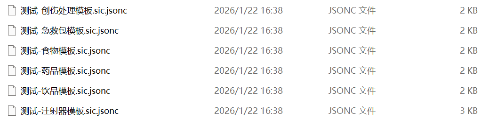

要求：

- 放置于`SptItemCreator/data`文件夹下的以`.sic`, `.sic.json`或`.sic.jsonc`结尾, 且内容符合jsonc格式的文件

- 至少拥有以下字段：

  ```json
  {
      "$type": "common", // 必须有
      "enable": false, // 修改后, 确定要添加后再改为true
      "baseInfo": {
          "id": "6900c8e93ea877662a000012", // 必须有, 且唯一
          "type": "common" // 可以省略，需要与`$type`一致
      }
  }
  ```

> 模组的data文件夹下会自带一些模板文件:
> 
> 

创建新物品数据文件的推荐方式：复制data文件夹下的模板文件，基于模板文件参考解析开始修改

同时一般情况请不要将模板文件的`enable`设置为true